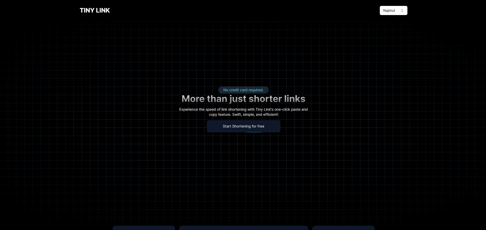

# Tiny Link

### It's a fullstack application using PERN stack application.

**Live Link**: https://tiny-link-frontend.vercel.app/

<!-- **Preview**: [YouTube](https://youtu.be/) -->

**Frontend Repository**: https://github.com/Najmul11/tiny-link/tree/main/client
**Backend Repository**: https://github.com/Najmul11/tiny-link/tree/main/backend

### Library and tools used in frontend

**Library**: `Next js`

**UI and styling**: `ShadCn`, `Tailwind CSS`

**Type Safety**: `TypeScript`

**Icon Library**: `React Icons`

### Library and tools used in backend

**Server**: `Node js`, `Express js`

**Database**: `PostgreSQL`

**Type Safety and validation**: `TypeScript`

**Authentication and authorization**: `jsonwebtoken`, `bcrypt`

**Linting and prettifying**: `ESLint`, `Prettier`

### Features

- [x] Tiny Link provides a sleek platform for managing and sharing long URLs.
- [x] Created powerful tools like link shortening, expiration dates, click limits, and view tracking, giving users full
      control over shared links.
- [x] Integrated QR code functionality to simplify access to shared links.

**Follow package.json for more scripts**

### Thanks for visiting this page, contact me at: [Najmul Hoque](https://www.linkedin.com/in/najmulhoque-/)
